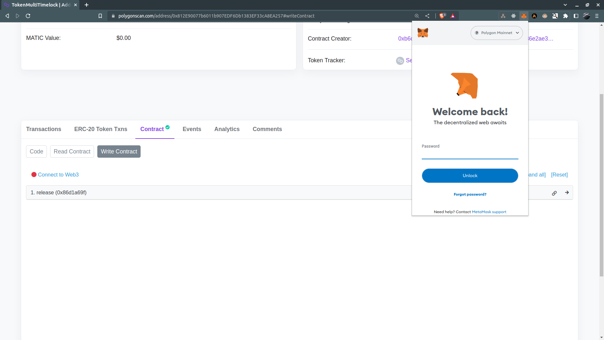
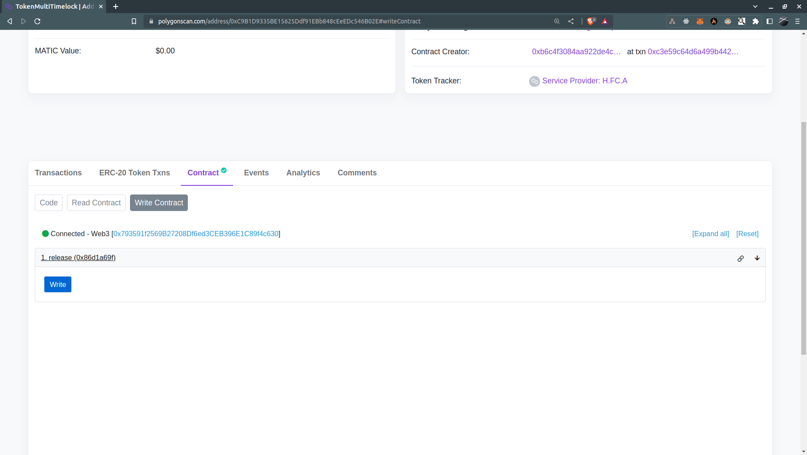

# Como destrancar os tokens do timelock dado seu tempo:


Vou pegar como exemplo, esses timelocks:

```
[
    //Service Provider: H.FC.A
    "0x812f90cB818b4DB72B3473F4aAFF75331Eb23111",

    //Service Provider: H.F.L.H
    "0x9044ae81385624b08A4460C5A22A9D10E44167dA",

    // Service Provider: H.F.J.D.B
    "0x20dd5A41B8D70F079A49657b1A59ceB444c8F6C7",

    // Service Provider: H.F.A.N
    "0xBe61D45Bfd587EcE3DFA3303BB519F25e1A00fa8",
]
```


Desde que os timelocks estejam seguindo o mesmo padrão de código desse repositório,
o tutorial aqui deve funcionar para cada um desses contratos. Em seguida, estão os passos
para fazer o unlock:


## 1. Entrar na aba "Write Contract" do contrato e ativar a conectar a carteira

Vamos usar como exemplo esse contrato:

https://polygonscan.com/address/0xC9B1D9335BE15625Ddf91EBb848cEeEDc546B02E#writeContract

Basicamente, você pode apenas mudar o endereço no link para o endereço do seu timelock.

Já deve aparecer uma página assim:



Você deve então conectar a carteira para que possa chamar a função de release.

## 2. Executar a função de release

Com a carteira conectada, já deve ser possível executar a função de release. Dito isso, se você estiver na hora certa de release, a transação deve
funcionar normalmente.



Ao clicar em Write, vai abrir uma aba da metamask para confirmar uma transação. Você vai precisar de um pouco de matic para fazer o release. 


Completada essa transação, os tokens vão para o endereço "beneficiário". Certifique-se que o endereço de beneficiário do seu contrato é o seu mesmo. Se não for, não tem problema executar a função. Os tokens sempre vão para o endereço do beneficiário, então você pode executar o contrato à partir de outra carteira sem problema.

Para ver o beneficiário (se estiver na dúvida), veja a aba ao lado, escrito "Read Contract":


